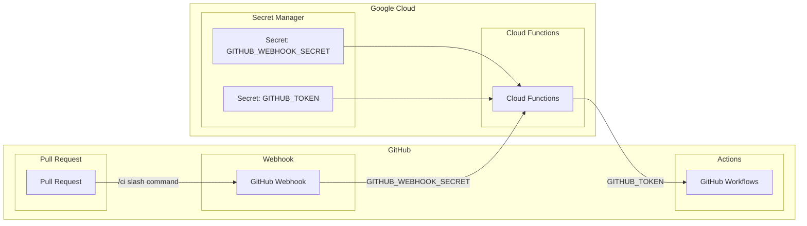

# ci-slash-command - GitHub Webhooks for GitHub Actions

ci-slash-command is a GitHub Webhooks that allows you to trigger GitHub Actions workflows using a `/ci` slash command in a pull request comment.

## Architecture



## Setup

1. Generate a new Personal Access Token (GITHUB_TOKEN) in your GitHub settings and copy it to your clipboard.
   - Select the following scopes: `workflow`, `repo`.
2. Generate a random string to use as `GITHUB_WEBHOOK_SECRET` and copy it to your clipboard:

```sh
openssl rand -hex 32 | pbcopy
```

3. Configure your Google Cloud project:
```sh
gcloud config set project $YOUR_PROJECT_ID
gcloud auth login
gcloud auth application-default login
gcloud services enable secretmanager.googleapis.com

echo -n "YOUR_GITHUB_TOKEN" | \
gcloud secrets create GITHUB_TOKEN \
    --replication-policy="automatic" \
    --data-file=-

echo -n "YOUR_GITHUB_WEBHOOK_SECRET" | \
gcloud secrets create GITHUB_WEBHOOK_SECRET \
    --replication-policy="automatic" \
    --data-file=-

PROJECT_ID=$(gcloud config get-value project)
SERVICE_ACCOUNT_NAME="github-webhooks"

gcloud iam service-accounts create ${SERVICE_ACCOUNT_NAME} \
    --display-name "GitHub Webhooks service account"

gcloud secrets add-iam-policy-binding GITHUB_TOKEN \
    --member="serviceAccount:${SERVICE_ACCOUNT_NAME}@${PROJECT_ID}.iam.gserviceaccount.com" \
    --role="roles/secretmanager.secretAccessor"

gcloud secrets add-iam-policy-binding GITHUB_WEBHOOK_SECRET \
    --member="serviceAccount:${SERVICE_ACCOUNT_NAME}@${PROJECT_ID}.iam.gserviceaccount.com" \
    --role="roles/secretmanager.secretAccessor"
```

4. Add a GitHub Webhook to your repository:
   - Payload URL: `https://$REGION-$PROJECT_ID.cloudfunctions.net/$FUNCTION_NAME`
     - For example: `https://asia-northeast-1-my-project-id.cloudfunctions.net/githubWebhook`
   - Content type: `application/json`
   - Select specific events to trigger the webhook:
     - `Let me select individual events.`
       - `Issue comments`
       - `Pull requests`

## Deployment

```sh
pnpm install
sh deploy.sh
```

The following is an example of how to deploy. Please modify MODULE_CI_WORKFLOWS, SERVICE_ACCOUNT_NAME, and FUNCTION_NAME to suit your project.

deploy.sh:
```sh
#!/bin/bash

npm run pre-build

# You can set the module ci workflows in the environment variable.
# key is the module name, value is the workflow file name.
MODULE_CI_WORKFLOWS='{"backend":"ci-backend.yml","frontend":"ci-frontend.yml","all":"ci.yml"}'
ENCODED_MODULE_CI_WORKFLOWS=$(echo "$MODULE_CI_WORKFLOWS" | base64)

PROJECT_ID=$(gcloud config get-value project)
SERVICE_ACCOUNT_NAME=github-webhooks
FUNCTION_NAME=githubWebhook

gcloud functions deploy ${FUNCTION_NAME} \
  --project ${PROJECT_ID} \
  --region asia-northeast1 \
  --gen2 \
  --runtime nodejs20 \
  --trigger-http \
  --allow-unauthenticated \
  --entry-point githubWebhook \
  --service-account ${SERVICE_ACCOUNT_NAME}@${PROJECT_ID}.iam.gserviceaccount.com \
  --set-env-vars GITHUB_API_INTERVAL=1000 \
  --set-env-vars MODULE_CI_WORKFLOWS=${ENCODED_MODULE_CI_WORKFLOWS} \
  --set-secrets GITHUB_TOKEN=projects/${PROJECT_ID}/secrets/GITHUB_TOKEN:latest,GITHUB_WEBHOOK_SECRET=projects/${PROJECT_ID}/secrets/GITHUB_WEBHOOK_SECRET:latest
```
